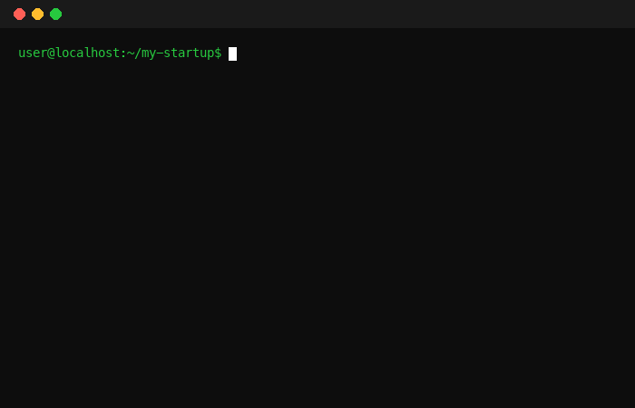

<p align="center">
  
</p>

<p align="center">Don't Build Alone. Let Shotgun Ride Along.</p>

## Quickstart

Pick a plain local folder — not OneDrive/Dropbox/iCloud (cloud sync fights git, see [docs/HARDENING.md](docs/HARDENING.md)).

### Install

**macOS / Linux:**
```bash
curl -sSL https://raw.githubusercontent.com/Krishnatejavepa/Shotgun/main/install.sh | bash
source ~/.zshrc
```

**Windows (PowerShell):**
```powershell
iwr https://raw.githubusercontent.com/Krishnatejavepa/Shotgun/main/install.ps1 -UseBasicParsing | iex
```

### Initialize

```bash
shotgun-init
```

This injects the full operating system into any project folder — the `SHOTGUN.md` loop, `.shotgun/` skills, memory and vault scaffolds, starter templates, and every agent entry point. Existing files are never overwritten.

Then open your agent and say **"hi"**. Shotgun interviews you, indexes your data, and starts compounding from session one.

> Already running Shotgun? Run `shotgun-upgrade` to update — your memory, vault, workspace, and learned skills stay untouched by contract, and the old framework is backed up first. CI tests this on every release.

<p align="center">
  
</p>

## What it does

Shotgun turns your AI agent into something that acts like it owns half the company. It reads its memory at the start of every session, picks up where it left off, and compounds what it knows about you, your product, and your market.

- **Persistent memory** - Founder profile, venture state, every decision with its "why", metrics, open loops, session journal. It knows your business better every day.
- **Full technical execution** - Plans, codes, tests, ships. 24 production-grade engineering skills built in. Verifies everything before handing it over.
- **Writes in your voice** - Learns from samples of your real writing. Launch posts, emails, landing copy, and investor updates that sound like you.
- **Autonomous loops** - Say "keep going until it works" and walk away. It writes a loop contract, cycles act–verify–fix, and exits verified-done or with a precise blocker report.
- **Distribution and sales** - One channel at a time, growth experiments with hypotheses and kill-dates, ICP definition, sourced prospects, a files-first CRM, outreach in your voice, close checklists.
- **Data vault** - Scattered files, CSVs, and notes organized into one indexed, canonical structure. Nothing ever deleted, everything findable.
- **The Panel** - Five specialist personas (product, design, QA, release, growth) review work before it ships and end with one verdict: ship, fix then ship, or rethink.
- **Cofounder judgment** - Pushes back on bad ideas once, then commits. Protects your focus. Treats reversible and irreversible decisions differently.
- **Operating rhythm** - Daily standups, weekly reviews, one thing per day, a staged company roadmap checked off on evidence, routines, and zombie-loop detection.
- **Legal and compliance** - Localized privacy policies, incorporation roadmaps, tax basics tracked to your jurisdiction. Attorney-disclaimed.
- **Self-healing** - Learned skills that improve with use, plus a monthly checkup that audits memory, vault hygiene, git safety, and secret leaks.
- **Portable** - Export your entire cofounder as a bundle, secrets excluded and verified. Import from Obsidian, Notion, or ChatGPT on day one.

<p align="center">
  
</p>

## How it works

```
shotgun/
├── SHOTGUN.md            # The operating loop — read every session, followed exactly
├── AGENTS.md             # Universal entry point (the AGENTS.md standard, 28+ tools)
├── .shotgun/
│   ├── skills/           # onboard, build, write, organize-data, decide, research,
│   │                     # grow, sell, design, legal, finance, roadmap, stack, daily,
│   │                     # loop, experiment, review, port, doctor + 24 eng skills
│   ├── commands/         # /build, /test, /deploy
│   └── agents/           # Specialist personas
├── memory/               # Profile, venture, voice, metrics, decisions, loops, journal
├── vault/                # Indexed, canonical business data
├── templates/            # SaaS, creator, agency, e-commerce starters
├── workspace/            # Code projects
└── docs/                 # Architecture, hardening, learned-skill format
```

Everything is plain markdown and git. No servers, no database, no lock-in. You can read every "thought" your cofounder has, edit it, or take it anywhere. A CI workflow validates every skill's frontmatter, every routing path, and the installer end-to-end on every push.

## Compatibility

Works on **any agent that reads the [AGENTS.md standard](https://agents.md)** - Codex CLI, Windsurf, Zed, Devin, Aider, Amp, Jules, and 20+ more.

First-class native wiring for:

<p align="center">
  <a href="https://claude.ai"></a>
  <a href="https://cursor.com"></a>
  <a href="https://gemini.google.com"></a>
  <a href="https://github.com/features/copilot"></a>
  <a href="https://idx.google.com"></a>
</p>

The operating loop is explicit checklists - any capable model (Claude Opus/Sonnet, GPT-5 class, Gemini 2.5 Pro+) executes it identically. No dependency on a specific model tier.

## Why Shotgun over a general assistant?

General assistants like OpenClaw or Hermes Agent are excellent - always on, connected to messaging apps, automating everything for everyone. Shotgun is deliberately the opposite.

| | General Assistants | Shotgun |
|---|---|---|
| **Scope** | Horizontal — for anyone | Vertical — for solo founders |
| **Behavior** | Does what you ask | Pushes back when you're wrong |
| **Data** | Chat history | Indexed vault, nothing deleted |
| **Security** | Always-on daemon | Runs only when you run it |
| **Memory** | Session-scoped | Compounds across months |

They win on 24/7 availability and channels. Shotgun wins on judgment, focus, and depth for one specific job: running a company of one.

*(Different tool, same name: [shotgun.sh](https://github.com/shotgun-sh/shotgun) is a spec-writing CLI for AI coding agents — not a cofounder. They coexist fine: use it inside `workspace/` projects.)*

<p align="center">
  
</p>

## Philosophy

1. **Memory is the product.** An assistant answers; a cofounder remembers why.
2. **Checklists over vibes.** Deterministic loops, consistent across models and months.
3. **Files over databases.** Inspectable, versionable, portable, yours.
4. **Trust through verification.** Nothing presented as done that wasn't run.
5. **Distribution is half the company.** A cofounder who only builds is half a cofounder.

## Documentation

- [Getting Started](GETTING-STARTED.md) - Full setup walkthrough
- [Security and Trust Model](SECURITY.md) - Why no-daemon matters
- [Architecture](docs/ARCHITECTURE.md) - Loop, memory, and vault internals
- [Hardening](docs/HARDENING.md) - Backups, hooks, permissions
- [Learned Skills](docs/LEARNED-SKILLS.md) - How the cofounder improves its own procedures
- [Memory Format Spec](docs/MEMORY-FORMAT.md) - The open Cofounder Memory Format (CMF)
- [Contributing](CONTRIBUTING.md) - Add skills, templates, and war stories
- [Governance](GOVERNANCE.md) - How decisions get made
- [Changelog](CHANGELOG.md) - What changed in v1.6.1

## License

MIT. Take it, run your company on it, build on it.
